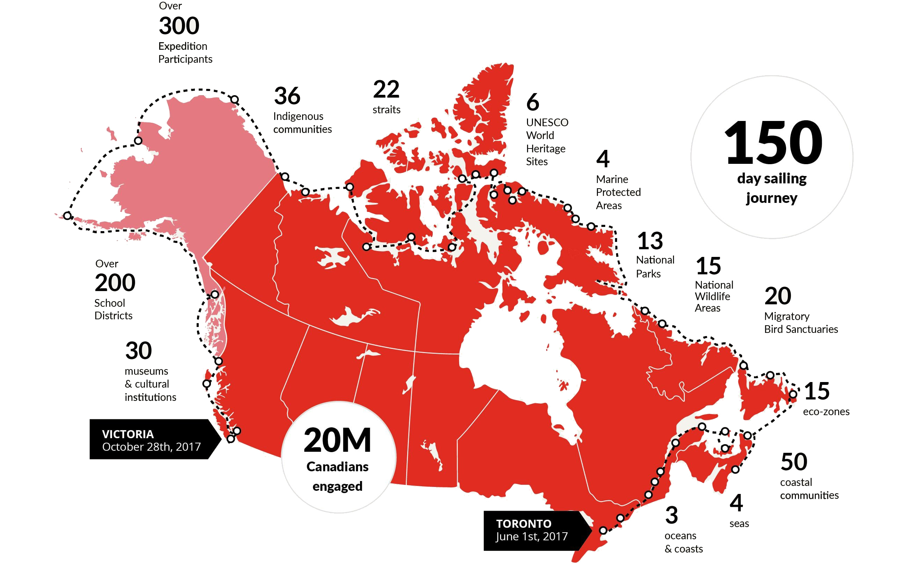

# Canada C3: A coast to coast to coast expedition
<picture>
 <source media="(prefers-color-scheme: dark)" srcset="www/landing-map.jpg">
 <source media="(prefers-color-scheme: light)" srcset="www/landing-map.jpg">
 
</picture>
In 2017, as an initiative of the Students on Ice Foundation (SOI Foundation), and with support from the Government of Canada and a variety of partners, the Canada C3 expedition travelled on the MV Polar Prince icebreaker along Canada's Atlantic, Arctic and Pacific coastlines, from Toronto to Victoria via the Northwest passage. This expedition brought together a diverse group of Canadians to explore Canada's coastline while reflecting on the journey's core themes of Diversity and Inclusion, Reconciliation, Youth Engagement and the Environment (Canada C3, 2017). During the 150-day expedition, opportunistic surface water samples were collected along the journey by the crew and project participants over 15 legs. The final pan-Canadian dataset resulted in one hundred eDNA samples collected along the Atlantic, Arctic and Pacific coasts of Canada. To learn more about the expedition, please visit https://canadac3.ca/en/homepage/

# What is eDNA?
Marine eDNA is organism DNA in the water from microbial cells, organisms' tissues, skin and scales, metabolic waste, or dissolved molecules. A sample of eDNA simply requires a collection of fixed volume of water and collection of associated eDNA onto a filter. Extraction and sequencing of this DNA can be used to investigate the taxonomic composition of whole marine communities ranging from invertebrates to fish and marine mammals.

# How to interpret the interactive map?
You can access the app here: https://fjedna.shinyapps.io/CanadaC3_shiny/. The map shows the eDNA index value associated with each species detected by eDNA during our sampling events. This species-specific index ranges from 0 (no DNA detected for the species) to 1 (maximum proportion of DNA detected for the species across all samples). The index reflects changes in the relative biomass (or proportion) of the species but do not reflect absolute changes in biomass. The index values can be used to assess spatial variations of biomass for a given species.
